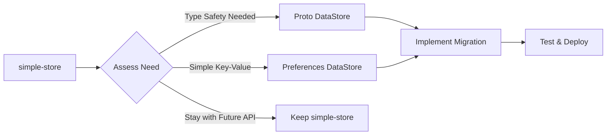

# Quick Reference: simple-store vs DataStore

## At a Glance

| Feature | simple-store | DataStore |
|---------|-------------|-----------|
| **API Style** | ListenableFuture | Coroutines/Flow |
| **Type Safety** | ❌ None | ✅ Full (with Proto) |
| **Complex Objects** | ❌ Manual serialization | ✅ Protocol Buffers |
| **Migration Support** | ❌ None | ✅ Built-in |
| **Error Recovery** | ❌ Basic | ✅ Advanced |
| **Multi-process** | ❌ No | ✅ Yes (1.1.0+) |
| **Observability** | ❌ One-shot | ✅ Flow-based |
| **Platform** | Android only | Android (KMP soon) |
| **Min SDK** | 14 | 24 |
| **Dependencies** | Minimal | Coroutines + optional Proto |

## Decision Matrix

### Choose simple-store if:
- ✅ You need minimal dependencies
- ✅ Your app requires SDK < 24
- ✅ You're heavily invested in ListenableFuture
- ✅ You only store simple string/byte data
- ✅ Startup performance is absolutely critical
- ✅ You cannot use Kotlin coroutines

### Choose DataStore if:
- ✅ You're building a modern Android app
- ✅ You need type safety
- ✅ You store complex data structures
- ✅ You want reactive data updates
- ✅ You need migration support
- ✅ You require multi-process access
- ✅ You follow Android best practices

### Migration Effort Estimate

| Scenario | Effort | Duration |
|----------|--------|----------|
| Small app (< 10 storage keys) | Low | 1-2 days |
| Medium app (10-50 keys) | Medium | 3-5 days |
| Large app (50+ keys) | High | 1-2 weeks |
| Complex data structures | High | 2-3 weeks |

## Code Comparison

### Basic Storage

**simple-store:**
```java
// Write
simpleStore.putString("key", "value")
    .addListener(() -> { /* done */ }, executor);

// Read
simpleStore.getString("key")
    .addListener(new Runnable() {
        public void run() {
            String value = future.get();
        }
    }, executor);
```

**DataStore:**
```kotlin
// Write
lifecycleScope.launch {
    dataStore.edit { prefs ->
        prefs[stringPreferencesKey("key")] = "value"
    }
}

// Read
val value = dataStore.data
    .map { prefs -> prefs[stringPreferencesKey("key")] }
    .first()
```

### Observing Changes

**simple-store:**
```java
// Not supported - must poll manually
```

**DataStore:**
```kotlin
// Automatic updates via Flow
dataStore.data
    .map { prefs -> prefs[stringPreferencesKey("key")] }
    .collect { value ->
        // Updated automatically when value changes
    }
```

## Migration Path Summary



## Common Patterns

### 1. Wrapper for Gradual Migration
```kotlin
interface StorageAdapter {
    suspend fun getString(key: String): String?
    suspend fun putString(key: String, value: String)
}

class DataStoreAdapter(
    private val dataStore: DataStore<Preferences>
) : StorageAdapter {
    override suspend fun getString(key: String): String? =
        dataStore.data.first()[stringPreferencesKey(key)]
    
    override suspend fun putString(key: String, value: String) {
        dataStore.edit { it[stringPreferencesKey(key)] = value }
    }
}

class SimpleStoreAdapter(
    private val simpleStore: SimpleStore
) : StorageAdapter {
    override suspend fun getString(key: String): String? =
        suspendCoroutine { cont ->
            Futures.addCallback(
                simpleStore.getString(key),
                object : FutureCallback<String?> {
                    override fun onSuccess(result: String?) {
                        cont.resume(result)
                    }
                    override fun onFailure(t: Throwable) {
                        cont.resumeWithException(t)
                    }
                },
                directExecutor()
            )
        }
    
    override suspend fun putString(key: String, value: String) {
        suspendCoroutine { cont ->
            Futures.addCallback(
                simpleStore.putString(key, value),
                object : FutureCallback<String> {
                    override fun onSuccess(result: String) {
                        cont.resume(Unit)
                    }
                    override fun onFailure(t: Throwable) {
                        cont.resumeWithException(t)
                    }
                },
                directExecutor()
            )
        }
    }
}
```

### 2. Feature Flag Migration
```kotlin
class FeatureFlaggedStorage(
    private val context: Context,
    private val isDataStoreEnabled: () -> Boolean
) {
    private val simpleStore by lazy { 
        SimpleStoreFactory.create(context, "app") 
    }
    
    private val dataStore by lazy { 
        context.dataStore 
    }
    
    private val adapter: StorageAdapter
        get() = if (isDataStoreEnabled()) {
            DataStoreAdapter(dataStore)
        } else {
            SimpleStoreAdapter(simpleStore)
        }
    
    suspend fun getValue(key: String) = adapter.getString(key)
    suspend fun setValue(key: String, value: String) = 
        adapter.putString(key, value)
}
```

## Performance Comparison

| Operation | simple-store | DataStore |
|-----------|-------------|-----------|
| First read | ~5-10ms | ~10-20ms |
| Subsequent reads | <1ms (cached) | <1ms (Flow) |
| Write | ~5-15ms | ~10-25ms |
| Memory overhead | Minimal | Moderate |
| Startup impact | Very Low | Low |

## Final Recommendation

**For new projects**: Use DataStore (Preferences for simple data, Proto for complex)

**For existing simple-store projects**: 
- Migrate if you need modern features
- Stay if it meets your needs and performance requirements

**Key insight**: The migration is technically feasible but should be driven by actual needs rather than just modernization for its own sake.